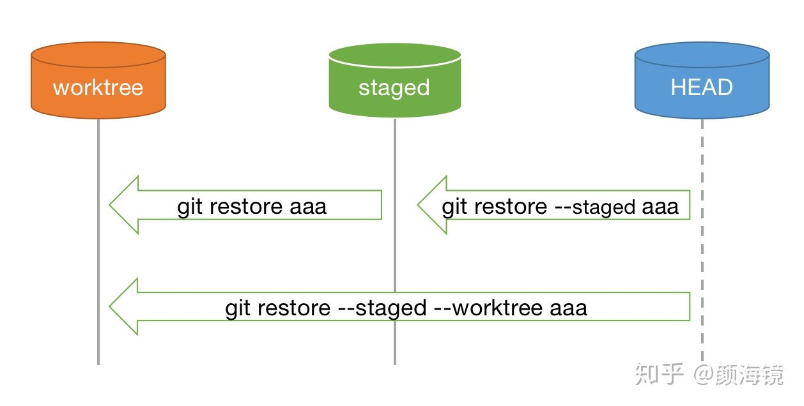

# [廖雪峰官方网站](https://www.liaoxuefeng.com/wiki/896043488029600)
# 安装git
- 官网下载,打开git Bash就是安装成功
	```
	git config --global user.name 'miyou'
	git config --global user.email '15755276427@163.com'
	```
	注意git config命令的--global参数，用了这个参数，表示你这台机器上所有的Git仓库都会使用这个配置，当然也可以对某个仓库指定不同的用户名和Email地址。
# 创建版本库
版本库又名仓库(repository)，如果你使用Windows系统，为了避免遇到各种莫名其妙的问题，请确保目录名（包括父目录）不包含中文。
1. 新建文件夹之后在里面执行
	```javascript
	git init //初始化生成.git隐藏文件
	```
	图片、视频这些二进制文件，虽然也能由版本控制系统管理，但没法跟踪文件的变化，只能把二进制文件每次改动串起来，也就是只知道图片从100KB改成了120KB，但到底改了啥，版本控制系统不知道，也没法知道。	不幸的是，Microsoft的Word格式是二进制格式，因此，版本控制系统是没法跟踪Word文件的改动的，	前面我们举的例子只是为了演示，如果要真正使用版本控制系统，就要以纯文本方式编写文件。	千万不要使用Windows自带的记事本编辑任何文本文件。原因是Microsoft开发记事本的团队使用了一个非常弱智的行为来保存UTF-8编码的文件，	他们自作聪明地在每个文件开头添加了0xefbbbf（十六进制）的字符，你会遇到很多不可思议的问题，比如，网页第一行可能会显示一个“?”，	明明正确的程序一编译就报语法错误，等等，都是由记事本的弱智行为带来的。
2. 在文件夹内创建readme.txt文件然后执行
	```javascript
	git add readme.txt //把文件添加到仓库
	git commit -m"关于本次提交的一些说明" //把文件提交到仓库
	```
	嫌麻烦不想输入-m "xxx"行不行？确实有办法可以这么干，自己google。为什么Git添加文件需要add，commit一共两步呢？因为commit可以一次提交很多文件，所以你可以多次add不同的文件
# 时光机穿梭
## 版本回退
1. 修改readme.txt
2. git status
	```javascript
	git status // 可以让我们时刻掌握仓库当前的状态
	git diff readme.txt // 查看readme.txt的不同
	```
3. git add readme.txt
4. git commit -m"第一次修改"
5. 之后多修改几次然后add commit
	```javascript
	git log // 显示从最近到最远的提交日志
	git log --pretty=oneline // 简化输出信息，数字是SHA1计算的hash值
	```
6. 版本回退
	```javascript
	git reset --hard HEAD^ // 回退一个版本
	git reset --hard HEAD~100 // 回退100个版本
	git reset --hard 1049a // 回退到指定hash对应的版本
	```
7. 找到被回退掉的版本号的hash值
	```javascript
	git log // 当前版本及之前的日志
	git reflog // 所有的日志
	```

## 工作区和暂存区
- Git和其他版本控制系统如SVN的一个不同之处就是有暂存区的概念。
- 第一步是用git add把文件添加进去，实际上就是把文件修改添加到暂存区
- 第二步是用git commit提交更改，实际上就是把暂存区的所有内容提交到当前分支	
- 因为我们创建Git版本库时，Git自动为我们创建了唯一一个master分支，所以，现在，git commit就是往master分支上提交更改。
## 管理修改
- 下面，我们要讨论的就是，为什么Git比其他版本控制系统设计得优秀，因为Git跟踪并管理的是修改，而非文件。
## [撤销修改](https://zhuanlan.zhihu.com/p/259385054?utm_source=wechat_session)
- `git restore [--worktree] aaa` : 从staged中恢复aaa到worktree 
- `git restore --staged aaa` : 从repo中恢复aaa到staged 
- `git restore --staged --worktree aaa` : 从repo中恢复aaa到staged和worktree 
- `git restore --source dev aaa` : 从指定commit中恢复aaa到worktree

- 旧版本命令
	```javascript
	/*
		可以丢弃工作区的修改，让这个文件回到最近一次git commit或git add时的状态
		没有--，就变成了“切换到另一个分支”的命令
	*/ 
	git checkout -- readme.txt 
	/*
		git reset命令既可以回退版本，也可以把暂存区的修改回退到工作区
	*/
	git reset HEAD readme.txt
	```
## 删除文件
- /先手动删除文件，然后使用git rm <file>和git add<file>效果是一样的。
	```javascript
	git rm test.txt
	```
# 远程仓库
## 添加远程库
网站上的是关于github使用ssh的一些讲解。	创建SSH Key。在用户主目录下，看看有没有.ssh目录，如果有，再看看这个目录下有没有id_rsa和id_rsa.pub这两个文件，如果已经有了，	可直接跳到下一步。如果没有，打开Shell（Windows下打开Git Bash），创建SSH Key：`ssh-keygen -t rsa -C "youremail@example.com"`
把本地库的内容推送到远程，用git push命令，实际上是把当前分支master推送到远程。由于远程库是空的，我们第一次推送master分支时，加上了-u参数，Git不但会把本地的master分支内容推送的远程新的master分支，还会把本地的master分支和远程的master分支关联起来，在以后的推送或者拉取时就可以简化命令。
## 从远程库克隆
- GitHub给出的地址不止一个，还可以用https://github.com/michaelliao/gitskills.git这样的地址。实际上，Git支持多种协议，默认的git://使用ssh，但也可以使用https等其他协议。使用https除了速度慢以外，还有个最大的麻烦是每次推送都必须输入口令，但是在某些只开放http端口的公司内部就无法使用ssh协议而只能用https。Git支持多种协议，包括https，但ssh协议速度最快。
	```
	git clone git@github.com:mi-you/test.git
	```
# 分支管理
分支在实际中有什么用呢？假设你准备开发一个新功能，但是需要两周才能完成，第一周你写了50%的代码，如果立刻提交，由于代码还没写完，	不完整的代码库会导致别人不能干活了。如果等代码全部写完再一次提交，又存在丢失每天进度的巨大风险。	现在有了分支，就不用怕了。你创建了一个属于你自己的分支，别人看不到，还继续在原来的分支上正常工作，而你在自己的分支上干活，	想提交就提交，直到开发完毕后，再一次性合并到原来的分支上，这样，既安全，又不影响别人工作。其他版本控制系统如SVN等都有分支管理，	但是用过之后你会发现，这些版本控制系统创建和切换分支比蜗牛还慢，简直让人无法忍受，结果分支功能成了摆设，大家都不去用。	但Git的分支是与众不同的，无论创建、切换和删除分支，Git在1秒钟之内就能完成！无论你的版本库是1个文件还是1万个文件。
## 创建与合并分支
	Git鼓励大量使用分支：
- 查看分支：git branch
- 创建分支：git branch <name>
- 切换分支：git switch <name> // 旧 git checkout <name>
-	创建+切换分支：git switch -c <name> // 旧 git checkout -b <name>
- 合并某分支到当前分支：git merge <name>
-	删除分支：git branch -d <name>
## 解决冲突
1. git switch -c feature1
2. 修改test.txt的第一行
3. git add test.txt
4. git commit -m'feature1'
5. git switch main
6. 修改test.txt的第一行
7. git add test.txt
8. git commit -m'main'
9. git merge feature1
10. 这之后手动解决test.txt文件冲突
11. git add test.txt
12. git commit -m'merge'
13. git log --graph --pretty=oneline --abbrev-commit  // 查看到分支合并图
## 分支管理策略
- 通常，合并分支时，如果可能，Git会用Fast forward模式，但这种模式下，删除分支后，会丢掉分支信息。如果要强制禁用Fast forward模式，Git就会在merge时生成一个新的commit，这样，从分支历史上就可以看出分支信息。
	```javascript 
	/*
		省略了创建切换分支，修改切换修改的过程
		因为本次合并要创建一个新的commit，所以加上-m参数，把commit描述写进去
		--no-ff参数就可以用普通模式合并，合并后的历史有分支
	*/
	git merge --no-ff -m "merge with no-ff" dev
	```
## bug分支
在Git中，由于分支是如此的强大，所以，每个bug都可以通过一个新的临时分支来修复，修复后，合并分支，然后将临时分支删除。	当你接到一个修复一个代号101的bug的任务时，很自然地，你想创建一个分支issue-101来修复它，但是，等等，当前正在dev上进行的工作还没有提交
1. 先检查一下工作区状态，看是是否是干净的，如果不是(注意不干净也需要是被git管理的，也就是新建的文件需要git add)
```javascript
git status
```
2. git stash可以把当前工作现场“储藏”起来，等以后恢复现场后继续工作
```javascript
git stash
```
3. 切换到要修复bug的分支,并在该分支下建立分支用于修复bug
```javascript
git switch master
// 创建并切换到分支
git switch -c bug-101
```
4. 修改bug之后,提交
```javascript
git add 'bug.txt'
// [bug-101 4c805e2] bug修好了
git commit -m'bug-101修好了'
```
5. 切换回要修复bug的分支，之后合并、删除、恢复
```javascript
git switch master
git merge --no-off -m'merge bug 101' bug-101
// 切换回最初的开发分支
git switch dev
// 此时工作区是干净的
git status
/*
 可以看到之前保存的工作状态
 stash@{0}: WIP on dev: f52c633 add merge
*/
git stash list
/*
	恢复之前的状态有两种方式
		1. git stash apply 此时stash内容并不删除
			 git stash drop 删除stash内容
		2. git stash pop，恢复的同时把stash内容也删了

		git stash apply stach@{0} //恢复指定的stash
*/ 
git stash pop
```
6. 如果同样的bug在dev上也有,除了重复操作一次还可以使用git cherry-pick：让我们能复制一个特定的提交到当前分支
```javascript
git branch dev
// 这个hash值是第四步中提交bug修改时产生的
git cherry-pick 4c805e2 
```
## feature分支
软件开发中，总有无穷无尽的新的功能要不断添加进来。添加一个新功能时，你肯定不希望因为一些实验性质的代码，把主分支搞乱了，所以，每添加一个新功能，最好新建一个feature分支，在上面开发，完成后，合并，最后，删除该feature分支。	现在，你终于接到了一个新任务：开发代号为Vulcan的新功能，该功能计划用于下一代星际飞船
```javascript
git switch -c feature-vulcan
git add vulcan.py
git commit -m'feature-valcan'
git switch dev
/*
 这时突然不要这个了
 如果下面的删除失败就把-d改为-D强制删除
*/
git branch -d feature-vulcan
```
## 多人协作
- 当你从远程仓库克隆时，实际上Git自动把本地的master分支和远程的master分支对应起来了，并且，远程仓库的默认名称是origin。
	```javascript
	//查看远程库的信息 
	git remote 
	/*
	显示更详细的信息（如果没有推送权限，就看不到push的地址）
		origin  https://github.com/mi-you/git.git (fetch)
		origin  https://github.com/mi-you/git.git (push)
	*/
	git remote -v 
	```
- 推送分支，就是把该分支上的所有本地提交推送到远程库。推送时，要指定本地分支，这样，Git就会把该分支推送到远程库对应的远程分支上
	```javascript
	/*
		如果要推送其他分支，比如dev，就改成：
			git push origin dev
	*/
	git push origin master
	```
- 抓取分支：多人协作时，大家都会往master和dev分支上推送各自的修改。
	```javascript
	/*
		默认情况下，你的小伙伴只能看到本地的master分支（main）
	*/ 
	git clone https://github.com/mi-you/git.git
	/*
		你的小伙伴要在dev分支上开发，就必须创建远程origin的dev分支到本地(前提远程是有dev分支的)
			$ git checkout -b dev origin/dev
	*/ 
	git switch -c dev origin/dev
	```
- 因此，多人协作的工作模式通常是这样：
	1. 首先，可以试图用git push origin <branch-name>推送自己的修改；
	2. 如果推送失败，则因为远程分支比你的本地更新，需要先用git pull试图合并；
	3. 如果合并有冲突，则解决冲突，并在本地提交；
	4. 没有冲突或者解决掉冲突后，再用git push origin <branch-name>推送就能成功！
	5. 如果git pull提示no tracking information，则说明本地分支和远程分支的链接关系没有创建，用命令git branch --set-upstream-to <branch-name> origin/<branch-name>。
	6. 这就是多人协作的工作模式，一旦熟悉了，就非常简单。
## rebase
rebase操作的特点：把分叉的提交历史“整理”成一条直线，看上去更直观。缺点是本地的分叉提交已经被修改过了
```javascript
	git rebase
```
# 标签管理
## 创建标签
- 在Git中打标签非常简单，首先，切换到需要打标签的分支上,然后，敲命令git tag <name>就可以打一个新标签
	```javascript
	git switch dev
	git tag v1.0 // v1.0标签
	git tag // 查看所有标签
	```
-	默认标签是打在最新提交的commit上的。有时候，如果忘了打标签，比如，现在已经是周五了，但应该在周一打的标签没有打，怎么办？方法是找到历史提交的commit id，然后打上就可以了
	```javascript
	git log --pretty=oneline --abbrev-commit
	git tag v0.9 e43a458
	git tag // 标签是按字母排序的
	git show <tagname> // 查看标签信息
	```
- 还可以创建带有说明的标签：
	```javascript
	/*
	-a指定标签名
	-m指定说明文字
	*/ 
	git tag -a v0.1 -m'version 0.1 released'
	```
标签总是和某个commit挂钩。如果这个commit既出现在master分支，又出现在dev分支，那么在这两个分支上都可以看到这个标签。
## 操作标签
- 删除标签
	```javascript
	git tag -d v0.1
	```
- 因为创建的标签都只存储在本地，不会自动推送到远程。所以，打错的标签可以在本地安全删除。如果要推送某个标签到远程，使用命令`git push origin <tagname>`
	```javascript
	git push orgin v1.0
	//	一次性推送全部尚未推送到远程的本地标签：
	git push orgin --tags
	```
- 如果标签已经推送到远程，要删除远程标签就麻烦一点
	```javascript
	// 先从本地删除：
	git tag -d v0.9
	// 然后，从远程删除。删除命令也是push，但是格式如下：
	git push origin :refs/tags/v0.9
	```
# 自定义git
- 显示不同的颜色
	```javascript
	// Git会适当地显示不同的颜色
	git config --global color.ui true 
	```
- 忽略特殊文件
在Git工作区的根目录下创建一个特殊的.gitignore文件，然后把要忽略的文件名填进去，GitHub已经为我们准备了各种配置文件，只需要组合一下就可以使用了。	所有配置文件可以直接在线浏览：https://github.com/github/gitignore	
	```javascript
	// 如果你确实想添加该文件，但该文件被忽略了，可以用-f强制添加到Git
	git add -f App.class
	```
	- 排除所有.开头的隐藏文件:
	`.*`
	- 排除所有.class文件:
	`*.class`
	- 不排除.gitignore和App.class:
	`!.gitignore`
	`!App.class`
## 配置别名
- alias.xx
	```javascript
	// 	git st === git status
	git config --global alias.st status
	// ... 
	git config --global alias.lg "log --color --graph --pretty=format:'%Cred%h%Creset -%C(yellow)%d%Creset %s %Cgreen(%cr) %C(bold blue)<%an>%Creset' --abbrev-commit"
	```
	
	
	
	
	
	
	
	
	
	
	
	
	
	
	
	
	
	
	
	
	
	
	
	
	
	
	
	
	